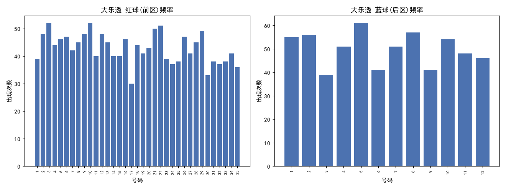
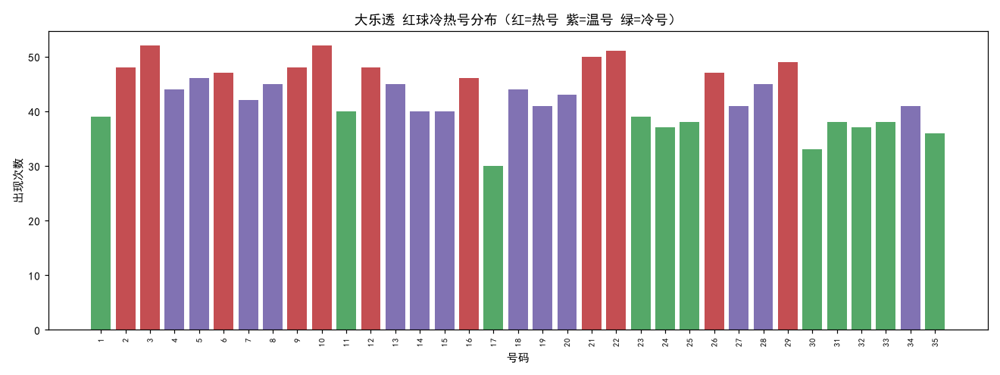
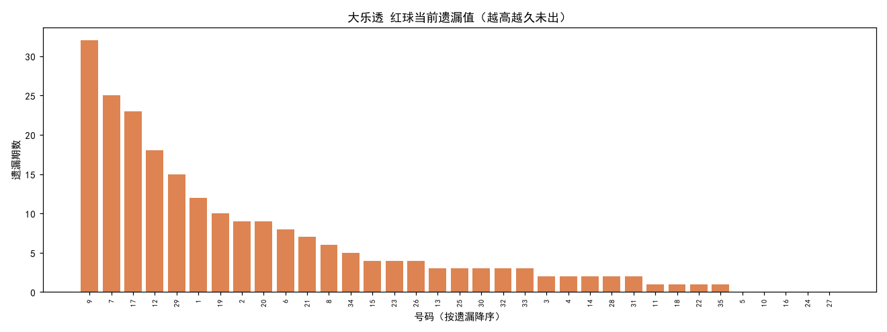
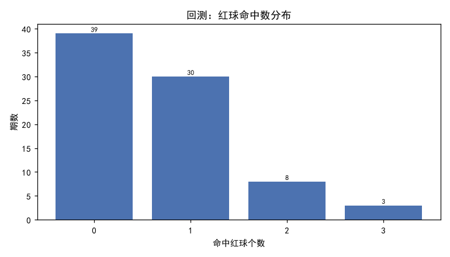

# 大乐透 选号策略分析报告

> 生成时间：2026-08-05T09:22:51 ｜ 数据源：500彩票网 ｜ 统计窗口：最近 300 期

## 一、数据概览

- 彩种：大乐透（dlt）
- 最新期号：26087（截至抓取时）
- 分析期数：300 期
- 规则：前区 1-35 选 5 个，后区 1-12 选 2 个，每注 ¥2

## 二、频率分析

- 红球理论平均出现次数：42.86 次
- 蓝球理论平均出现次数：50.0 次
- 红球和值区间：42 ~ 155（均值 87.3）
- 红球平均奇偶比（奇数占比）：0.501

## 三、冷热号分布

- 热号（高频）：红球 16 06 26 02 09 12 29 21 22 03 10
- 温号：红球 14 15 19 27 34 07 20 04 18 08 13 28 05
- 冷号（低频）：红球 17 30 35 24 32 25 31 33 01 23 11

## 四、遗漏分析

- 红球高遗漏（最久未出，优先回补候选）：09(遗32) 07(遗25) 17(遗23) 12(遗18) 29(遗15) 01(遗12) 19(遗10) 02(遗9) 20(遗9) 06(遗8) 21(遗7)

## 五、数据驱动选号推荐

### 策略：balanced（均衡混合：频率与遗漏加权综合（55%频率 / 45%遗漏））

**主推**：红球 07 09 12 17 29 ｜ 蓝球 01 03
  备选1：红球 02 07 09 12 17 ｜ 蓝球 01 08
  备选2：红球 07 09 12 21 29 ｜ 蓝球 03 11
  备选3：红球 06 07 09 17 29 ｜ 蓝球 02 03
  备选4：红球 07 12 17 20 29 ｜ 蓝球 03 05

**红球候选池（前 11）**
| 号码 | 综合分 | 出现次数 | 近30期 | 当前遗漏 | 最大遗漏 |
|-----|-------|---------|-------|---------|---------|
| 09 | 0.958 | 48 | 0 | 32 | 32 |
| 07 | 0.796 | 42 | 2 | 25 | 31 |
| 12 | 0.761 | 48 | 5 | 18 | 21 |
| 29 | 0.729 | 49 | 4 | 15 | 29 |
| 17 | 0.641 | 30 | 2 | 23 | 35 |
| 02 | 0.634 | 48 | 1 | 9 | 23 |
| 21 | 0.627 | 50 | 6 | 7 | 29 |
| 06 | 0.610 | 47 | 4 | 8 | 17 |
| 20 | 0.581 | 43 | 4 | 9 | 45 |
| 01 | 0.581 | 39 | 3 | 12 | 34 |
| 03 | 0.578 | 52 | 4 | 2 | 29 |

**蓝球候选池（前 8）**
| 号码 | 综合分 | 出现次数 | 近30期 | 当前遗漏 | 最大遗漏 |
|-----|-------|---------|-------|---------|---------|
| 01 | 0.862 | 55 | 4 | 13 | 21 |
| 03 | 0.802 | 39 | 2 | 16 | 32 |
| 08 | 0.711 | 57 | 4 | 7 | 17 |
| 11 | 0.686 | 48 | 5 | 9 | 36 |
| 02 | 0.645 | 56 | 7 | 5 | 21 |
| 05 | 0.606 | 61 | 6 | 2 | 16 |
| 07 | 0.516 | 51 | 7 | 2 | 28 |
| 10 | 0.487 | 54 | 5 | 0 | 15 |

### 策略：hot（热号优先：选取统计窗口内出现频率最高的号码）

**主推**：红球 03 10 21 22 29 ｜ 蓝球 05 08
  备选1：红球 02 03 10 21 22 ｜ 蓝球 02 05
  备选2：红球 03 09 10 21 29 ｜ 蓝球 01 08
  备选3：红球 03 10 12 22 29 ｜ 蓝球 08 10
  备选4：红球 03 06 21 22 29 ｜ 蓝球 04 08

**红球候选池（前 11）**
| 号码 | 综合分 | 出现次数 | 近30期 | 当前遗漏 | 最大遗漏 |
|-----|-------|---------|-------|---------|---------|
| 03 | 1.000 | 52 | 4 | 2 | 29 |
| 10 | 1.000 | 52 | 7 | 0 | 22 |
| 22 | 0.981 | 51 | 5 | 1 | 17 |
| 21 | 0.962 | 50 | 6 | 7 | 29 |
| 29 | 0.942 | 49 | 4 | 15 | 29 |
| 02 | 0.923 | 48 | 1 | 9 | 23 |
| 09 | 0.923 | 48 | 0 | 32 | 32 |
| 12 | 0.923 | 48 | 5 | 18 | 21 |
| 06 | 0.904 | 47 | 4 | 8 | 17 |
| 26 | 0.904 | 47 | 8 | 4 | 37 |
| 05 | 0.885 | 46 | 4 | 0 | 36 |

**蓝球候选池（前 8）**
| 号码 | 综合分 | 出现次数 | 近30期 | 当前遗漏 | 最大遗漏 |
|-----|-------|---------|-------|---------|---------|
| 05 | 1.000 | 61 | 6 | 2 | 16 |
| 08 | 0.934 | 57 | 4 | 7 | 17 |
| 02 | 0.918 | 56 | 7 | 5 | 21 |
| 01 | 0.902 | 55 | 4 | 13 | 21 |
| 10 | 0.885 | 54 | 5 | 0 | 15 |
| 04 | 0.836 | 51 | 6 | 0 | 23 |
| 07 | 0.836 | 51 | 7 | 2 | 28 |
| 11 | 0.787 | 48 | 5 | 9 | 36 |

### 策略：cold（冷号回补：选取当前遗漏值最大的号码（假设'该出'））

**主推**：红球 07 09 12 17 29 ｜ 蓝球 01 03
  备选1：红球 01 07 09 12 17 ｜ 蓝球 01 11
  备选2：红球 07 09 12 19 29 ｜ 蓝球 03 08
  备选3：红球 02 07 09 17 29 ｜ 蓝球 02 03
  备选4：红球 07 12 17 20 29 ｜ 蓝球 03 09

**红球候选池（前 11）**
| 号码 | 综合分 | 出现次数 | 近30期 | 当前遗漏 | 最大遗漏 |
|-----|-------|---------|-------|---------|---------|
| 09 | 1.000 | 48 | 0 | 32 | 32 |
| 07 | 0.781 | 42 | 2 | 25 | 31 |
| 17 | 0.719 | 30 | 2 | 23 | 35 |
| 12 | 0.562 | 48 | 5 | 18 | 21 |
| 29 | 0.469 | 49 | 4 | 15 | 29 |
| 01 | 0.375 | 39 | 3 | 12 | 34 |
| 19 | 0.312 | 41 | 5 | 10 | 27 |
| 02 | 0.281 | 48 | 1 | 9 | 23 |
| 20 | 0.281 | 43 | 4 | 9 | 45 |
| 06 | 0.250 | 47 | 4 | 8 | 17 |
| 21 | 0.219 | 50 | 6 | 7 | 29 |

**蓝球候选池（前 8）**
| 号码 | 综合分 | 出现次数 | 近30期 | 当前遗漏 | 最大遗漏 |
|-----|-------|---------|-------|---------|---------|
| 03 | 1.000 | 39 | 2 | 16 | 32 |
| 01 | 0.812 | 55 | 4 | 13 | 21 |
| 11 | 0.562 | 48 | 5 | 9 | 36 |
| 08 | 0.438 | 57 | 4 | 7 | 17 |
| 02 | 0.312 | 56 | 7 | 5 | 21 |
| 09 | 0.250 | 41 | 3 | 4 | 21 |
| 05 | 0.125 | 61 | 6 | 2 | 16 |
| 07 | 0.125 | 51 | 7 | 2 | 28 |

---

【风险提示】彩票开奖为独立随机事件，历史统计仅描述「已经发生」的规律，无法预测未来走势。本程序所有推荐均基于历史数据的娱乐性参考，不构成任何投资建议，不保证中奖。请理性购彩、量力而行，切勿追号或倍投超出自身承受范围；未满18周岁禁止购彩。

## 六、历史命中率回测

### 策略：balanced

- 回测期数：80（训练窗口 300 期）
- 平均命中：红球 0.688 个 / 蓝球 0.362 个
- 实际中奖率（任意奖级）：10.00%
- 理论随机中奖率：6.6705%
- 浮动奖（一/二等奖）命中：0 次（奖金随奖池浮动）
- 固定奖金投入合计：¥160 ｜ 固定奖金回报：¥60.0 ｜ 净盈亏（仅固定奖）：¥-100.0

**奖级命中明细**
| 奖级 | 名称 | 命中次数 | 单注固定奖金 |
|-----|------|---------|-------------|
| 8 | 八等奖 | 2 | ¥15 |
| 9 | 九等奖 | 6 | ¥5 |

**红球命中数分布**
| 命中红球数 | 期数 |
|-----------|------|
| 0 | 39 |
| 1 | 30 |
| 2 | 8 |
| 3 | 3 |

### 策略：hot

- 回测期数：80（训练窗口 300 期）
- 平均命中：红球 0.7 个 / 蓝球 0.338 个
- 实际中奖率（任意奖级）：8.75%
- 理论随机中奖率：6.6705%
- 浮动奖（一/二等奖）命中：0 次（奖金随奖池浮动）
- 固定奖金投入合计：¥160 ｜ 固定奖金回报：¥35.0 ｜ 净盈亏（仅固定奖）：¥-125.0

**奖级命中明细**
| 奖级 | 名称 | 命中次数 | 单注固定奖金 |
|-----|------|---------|-------------|
| 9 | 九等奖 | 7 | ¥5 |

**红球命中数分布**
| 命中红球数 | 期数 |
|-----------|------|
| 0 | 39 |
| 1 | 28 |
| 2 | 11 |
| 3 | 2 |

### 策略：cold

- 回测期数：80（训练窗口 300 期）
- 平均命中：红球 0.675 个 / 蓝球 0.263 个
- 实际中奖率（任意奖级）：3.75%
- 理论随机中奖率：6.6705%
- 浮动奖（一/二等奖）命中：0 次（奖金随奖池浮动）
- 固定奖金投入合计：¥160 ｜ 固定奖金回报：¥15.0 ｜ 净盈亏（仅固定奖）：¥-145.0

**奖级命中明细**
| 奖级 | 名称 | 命中次数 | 单注固定奖金 |
|-----|------|---------|-------------|
| 9 | 九等奖 | 3 | ¥5 |

**红球命中数分布**
| 命中红球数 | 期数 |
|-----------|------|
| 0 | 38 |
| 1 | 32 |
| 2 | 8 |
| 3 | 2 |

## 七、结论

回测显示，各策略的实际中奖率与组合数学计算的「理论随机中奖率」基本吻合，说明基于历史统计的选号策略**并未获得超越随机的预测优势**。
号码的冷热与遗漏只是对历史的归纳，不可作为未来走势依据。
本报告仅供统计分析研究与娱乐参考。
