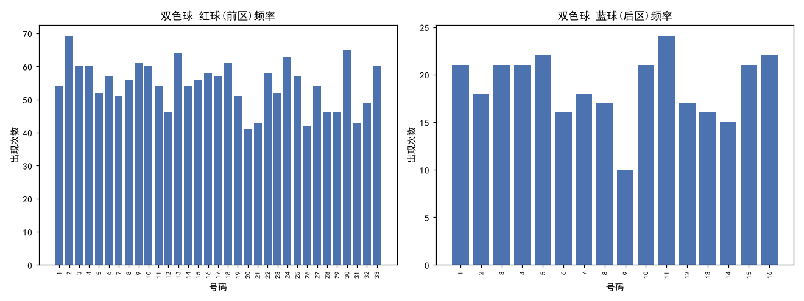
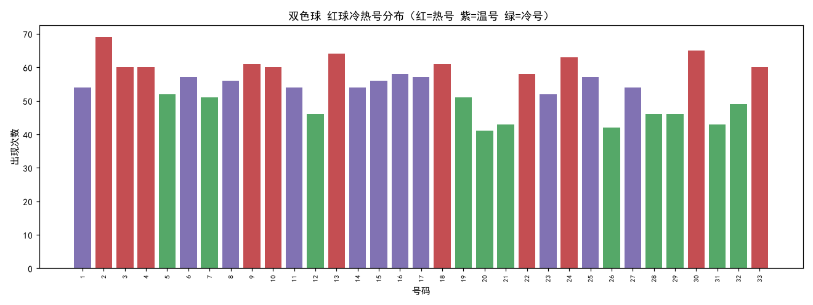
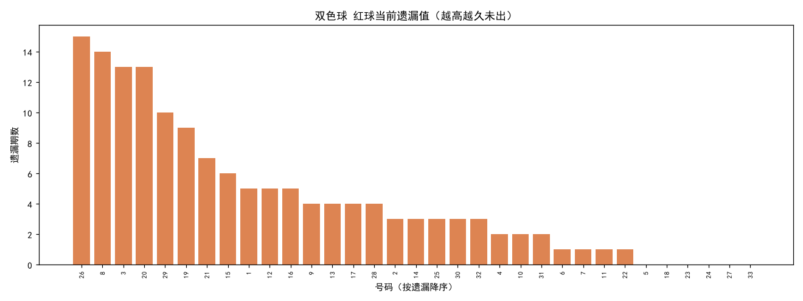
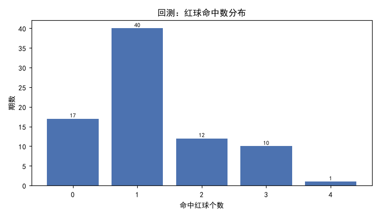

# 双色球 选号策略分析报告

> 生成时间：2026-08-05T09:22:45 ｜ 数据源：500彩票网 ｜ 统计窗口：最近 300 期

## 一、数据概览

- 彩种：双色球（ssq）
- 最新期号：26089（截至抓取时）
- 分析期数：300 期
- 规则：前区 1-33 选 6 个，后区 1-16 选 1 个，每注 ¥2

## 二、频率分析

- 红球理论平均出现次数：54.55 次
- 蓝球理论平均出现次数：18.75 次
- 红球和值区间：41 ~ 153（均值 99.5）
- 红球平均奇偶比（奇数占比）：0.508

## 三、冷热号分布

- 热号（高频）：红球 22 03 04 10 33 09 18 24 13 30 02
- 温号：红球 23 01 11 14 27 08 15 06 17 25 16
- 冷号（低频）：红球 20 26 21 31 12 28 29 32 07 19 05

## 四、遗漏分析

- 红球高遗漏（最久未出，优先回补候选）：26(遗15) 08(遗14) 03(遗13) 20(遗13) 29(遗10) 19(遗9) 21(遗7) 15(遗6) 01(遗5) 12(遗5) 16(遗5)

## 五、数据驱动选号推荐

### 策略：balanced（均衡混合：频率与遗漏加权综合（55%频率 / 45%遗漏））

**主推**：红球 03 08 19 20 26 29 ｜ 蓝球 14
  备选1：红球 02 03 08 19 20 26 ｜ 蓝球 10
  备选2：红球 03 08 13 19 20 29 ｜ 蓝球 16
  备选3：红球 03 08 15 19 26 29 ｜ 蓝球 02
  备选4：红球 03 08 16 20 26 29 ｜ 蓝球 11

**红球候选池（前 12）**
| 号码 | 综合分 | 出现次数 | 近30期 | 当前遗漏 | 最大遗漏 |
|-----|-------|---------|-------|---------|---------|
| 03 | 0.868 | 60 | 4 | 13 | 18 |
| 08 | 0.866 | 56 | 6 | 14 | 17 |
| 26 | 0.785 | 42 | 2 | 15 | 34 |
| 20 | 0.717 | 41 | 1 | 13 | 30 |
| 19 | 0.676 | 51 | 5 | 9 | 20 |
| 29 | 0.667 | 46 | 6 | 10 | 26 |
| 02 | 0.640 | 69 | 4 | 3 | 23 |
| 13 | 0.630 | 64 | 2 | 4 | 22 |
| 15 | 0.626 | 56 | 5 | 6 | 14 |
| 16 | 0.612 | 58 | 7 | 5 | 32 |
| 30 | 0.608 | 65 | 5 | 3 | 22 |
| 09 | 0.606 | 61 | 4 | 4 | 14 |

**蓝球候选池（前 7）**
| 号码 | 综合分 | 出现次数 | 近30期 | 当前遗漏 | 最大遗漏 |
|-----|-------|---------|-------|---------|---------|
| 14 | 0.794 | 15 | 0 | 65 | 65 |
| 10 | 0.744 | 21 | 0 | 38 | 44 |
| 16 | 0.663 | 22 | 1 | 23 | 39 |
| 02 | 0.579 | 18 | 2 | 24 | 60 |
| 11 | 0.564 | 24 | 2 | 2 | 40 |
| 01 | 0.544 | 21 | 3 | 9 | 64 |
| 04 | 0.530 | 21 | 5 | 7 | 61 |

### 策略：hot（热号优先：选取统计窗口内出现频率最高的号码）

**主推**：红球 02 09 13 18 24 30 ｜ 蓝球 11
  备选1：红球 02 03 09 13 18 24 ｜ 蓝球 05
  备选2：红球 02 04 09 13 18 30 ｜ 蓝球 16
  备选3：红球 02 09 10 13 24 30 ｜ 蓝球 01
  备选4：红球 02 09 18 24 30 33 ｜ 蓝球 03

**红球候选池（前 12）**
| 号码 | 综合分 | 出现次数 | 近30期 | 当前遗漏 | 最大遗漏 |
|-----|-------|---------|-------|---------|---------|
| 02 | 1.000 | 69 | 4 | 3 | 23 |
| 30 | 0.942 | 65 | 5 | 3 | 22 |
| 13 | 0.927 | 64 | 2 | 4 | 22 |
| 24 | 0.913 | 63 | 9 | 0 | 20 |
| 09 | 0.884 | 61 | 4 | 4 | 14 |
| 18 | 0.884 | 61 | 8 | 0 | 14 |
| 03 | 0.870 | 60 | 4 | 13 | 18 |
| 04 | 0.870 | 60 | 6 | 2 | 23 |
| 10 | 0.870 | 60 | 6 | 2 | 18 |
| 33 | 0.870 | 60 | 5 | 0 | 22 |
| 16 | 0.841 | 58 | 7 | 5 | 32 |
| 22 | 0.841 | 58 | 3 | 1 | 30 |

**蓝球候选池（前 7）**
| 号码 | 综合分 | 出现次数 | 近30期 | 当前遗漏 | 最大遗漏 |
|-----|-------|---------|-------|---------|---------|
| 11 | 1.000 | 24 | 2 | 2 | 40 |
| 05 | 0.917 | 22 | 4 | 1 | 64 |
| 16 | 0.917 | 22 | 1 | 23 | 39 |
| 01 | 0.875 | 21 | 3 | 9 | 64 |
| 03 | 0.875 | 21 | 2 | 0 | 52 |
| 04 | 0.875 | 21 | 5 | 7 | 61 |
| 10 | 0.875 | 21 | 0 | 38 | 44 |

### 策略：cold（冷号回补：选取当前遗漏值最大的号码（假设'该出'））

**主推**：红球 03 08 19 20 26 29 ｜ 蓝球 14
  备选1：红球 03 08 19 20 21 26 ｜ 蓝球 10
  备选2：红球 03 08 15 19 20 29 ｜ 蓝球 09
  备选3：红球 01 03 08 19 26 29 ｜ 蓝球 02
  备选4：红球 03 08 12 20 26 29 ｜ 蓝球 16

**红球候选池（前 12）**
| 号码 | 综合分 | 出现次数 | 近30期 | 当前遗漏 | 最大遗漏 |
|-----|-------|---------|-------|---------|---------|
| 26 | 1.000 | 42 | 2 | 15 | 34 |
| 08 | 0.933 | 56 | 6 | 14 | 17 |
| 03 | 0.867 | 60 | 4 | 13 | 18 |
| 20 | 0.867 | 41 | 1 | 13 | 30 |
| 29 | 0.667 | 46 | 6 | 10 | 26 |
| 19 | 0.600 | 51 | 5 | 9 | 20 |
| 21 | 0.467 | 43 | 5 | 7 | 32 |
| 15 | 0.400 | 56 | 5 | 6 | 14 |
| 01 | 0.333 | 54 | 6 | 5 | 24 |
| 12 | 0.333 | 46 | 5 | 5 | 26 |
| 16 | 0.333 | 58 | 7 | 5 | 32 |
| 09 | 0.267 | 61 | 4 | 4 | 14 |

**蓝球候选池（前 7）**
| 号码 | 综合分 | 出现次数 | 近30期 | 当前遗漏 | 最大遗漏 |
|-----|-------|---------|-------|---------|---------|
| 14 | 1.000 | 15 | 0 | 65 | 65 |
| 10 | 0.585 | 21 | 0 | 38 | 44 |
| 09 | 0.415 | 10 | 1 | 27 | 87 |
| 02 | 0.369 | 18 | 2 | 24 | 60 |
| 16 | 0.354 | 22 | 1 | 23 | 39 |
| 13 | 0.339 | 16 | 1 | 22 | 58 |
| 08 | 0.246 | 17 | 3 | 16 | 52 |

---

【风险提示】彩票开奖为独立随机事件，历史统计仅描述「已经发生」的规律，无法预测未来走势。本程序所有推荐均基于历史数据的娱乐性参考，不构成任何投资建议，不保证中奖。请理性购彩、量力而行，切勿追号或倍投超出自身承受范围；未满18周岁禁止购彩。

## 六、历史命中率回测

### 策略：balanced

- 回测期数：80（训练窗口 300 期）
- 平均命中：红球 1.225 个 / 蓝球 0.037 个
- 实际中奖率（任意奖级）：5.00%
- 理论随机中奖率：6.7095%
- 浮动奖（一/二等奖）命中：0 次（奖金随奖池浮动）
- 固定奖金投入合计：¥160 ｜ 固定奖金回报：¥25.0 ｜ 净盈亏（仅固定奖）：¥-135.0

**奖级命中明细**
| 奖级 | 名称 | 命中次数 | 单注固定奖金 |
|-----|------|---------|-------------|
| 5 | 五等奖 | 1 | ¥10 |
| 6 | 六等奖 | 3 | ¥5 |

**红球命中数分布**
| 命中红球数 | 期数 |
|-----------|------|
| 0 | 17 |
| 1 | 40 |
| 2 | 12 |
| 3 | 10 |
| 4 | 1 |

### 策略：hot

- 回测期数：80（训练窗口 300 期）
- 平均命中：红球 1.113 个 / 蓝球 0.037 个
- 实际中奖率（任意奖级）：3.75%
- 理论随机中奖率：6.7095%
- 浮动奖（一/二等奖）命中：0 次（奖金随奖池浮动）
- 固定奖金投入合计：¥160 ｜ 固定奖金回报：¥15.0 ｜ 净盈亏（仅固定奖）：¥-145.0

**奖级命中明细**
| 奖级 | 名称 | 命中次数 | 单注固定奖金 |
|-----|------|---------|-------------|
| 6 | 六等奖 | 3 | ¥5 |

**红球命中数分布**
| 命中红球数 | 期数 |
|-----------|------|
| 0 | 22 |
| 1 | 31 |
| 2 | 23 |
| 3 | 4 |

### 策略：cold

- 回测期数：80（训练窗口 300 期）
- 平均命中：红球 1.087 个 / 蓝球 0.037 个
- 实际中奖率（任意奖级）：5.00%
- 理论随机中奖率：6.7095%
- 浮动奖（一/二等奖）命中：0 次（奖金随奖池浮动）
- 固定奖金投入合计：¥160 ｜ 固定奖金回报：¥25.0 ｜ 净盈亏（仅固定奖）：¥-135.0

**奖级命中明细**
| 奖级 | 名称 | 命中次数 | 单注固定奖金 |
|-----|------|---------|-------------|
| 5 | 五等奖 | 1 | ¥10 |
| 6 | 六等奖 | 3 | ¥5 |

**红球命中数分布**
| 命中红球数 | 期数 |
|-----------|------|
| 0 | 21 |
| 1 | 36 |
| 2 | 19 |
| 3 | 3 |
| 4 | 1 |

## 七、结论

回测显示，各策略的实际中奖率与组合数学计算的「理论随机中奖率」基本吻合，说明基于历史统计的选号策略**并未获得超越随机的预测优势**。
号码的冷热与遗漏只是对历史的归纳，不可作为未来走势依据。
本报告仅供统计分析研究与娱乐参考。
